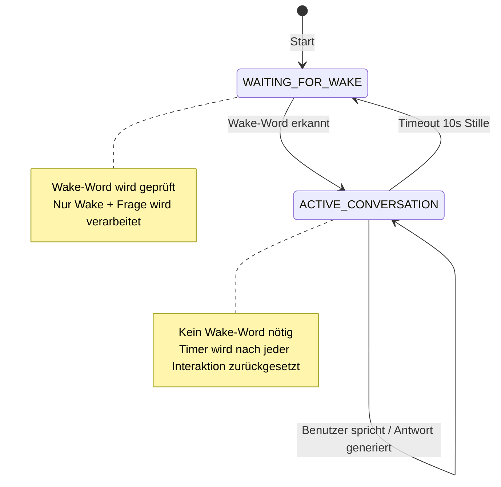

# Conversation Mode Implementation Plan

## 🎯 Ziel
Wake-Word nur einmal benötigen, um einen Konversationsmodus zu starten. Nach 10 Sekunden Stille automatischer Reset in Warte-Modus.

## 🔄 State Machine



## 📁 Zu ändernde Datei
**Einzige Datei:** `examples/talk-llama/talk-llama.cpp`

---

## 📋 Implementierungsschritte

### 1. Enum definieren (nach Zeile 18)
```cpp
// Conversation state machine
enum ConversationState {
    WAITING_FOR_WAKE,      // Wartet auf Wake-Word
    ACTIVE_CONVERSATION    // Aktiver Dialog, kein Wake-Word nötig
};
```

### 2. Parameter zum Struct hinzufügen (in whisper_params, ~Zeile 71)
```cpp
int32_t conv_timeout_ms = 10000;  // Conversation timeout in milliseconds
```

### 3. CLI-Argument parsen (in whisper_params_parse, ~Zeile 129)
```cpp
else if (arg == "-ct" || arg == "--conv-timeout") { params.conv_timeout_ms = std::stoi(argv[++i]); }
```

### 4. Hilfe-Text ergänzen (in whisper_print_usage, ~Zeile 184)
```cpp
fprintf(stderr, "  -ct N,    --conv-timeout N [%-7d] conversation timeout in ms (0 = disabled)\n", params.conv_timeout_ms);
```

### 5. State und Timer initialisieren (vor Hauptschleife, ~Zeile 547)
```cpp
// conversation mode state machine
ConversationState conv_state = WAITING_FOR_WAKE;
auto last_interaction_time = std::chrono::steady_clock::now();

// show conversation mode info if wake command is enabled
if (use_wake_cmd && params.conv_timeout_ms > 0) {
    printf("%s : conversation mode enabled - timeout: %d ms\n", __func__, params.conv_timeout_ms);
}
```

### 6. Timeout-Check in Hauptschleife (nach `std::this_thread::sleep_for`, ~Zeile 578)
```cpp
// check for conversation timeout
if (conv_state == ACTIVE_CONVERSATION && params.conv_timeout_ms > 0) {
    auto now = std::chrono::steady_clock::now();
    auto elapsed = std::chrono::duration_cast<std::chrono::milliseconds>(now - last_interaction_time).count();
    
    if (elapsed > params.conv_timeout_ms) {
        conv_state = WAITING_FOR_WAKE;
        printf("\n%s : conversation timeout - waiting for wake command\n", __func__);
        printf("%s%s", params.person.c_str(), chat_symb.c_str());
        fflush(stdout);
    }
}
```

### 7. Wake-Word-Logik umbauen (~Zeile 608-616)
**Vorher:**
```cpp
// check if audio starts with the wake-up command if enabled
if (use_wake_cmd) {
    const float sim = similarity(wake_cmd_heard, wake_cmd);

    if ((sim < 0.7f) || (text_heard.empty())) {
        audio.clear();
        continue;
    }
}
```

**Nachher:**
```cpp
// check if audio starts with the wake-up command if enabled
if (use_wake_cmd) {
    if (conv_state == WAITING_FOR_WAKE) {
        // In waiting state: require wake command
        const float sim = similarity(wake_cmd_heard, wake_cmd);

        if ((sim < 0.7f) || (text_heard.empty())) {
            audio.clear();
            continue;
        }
        
        // Wake command recognized - switch to active conversation
        conv_state = ACTIVE_CONVERSATION;
        last_interaction_time = std::chrono::steady_clock::now();
        printf("\n%s : wake command recognized - entering conversation mode\n", __func__);
    } else {
        // In active conversation: use all heard text (no wake command needed)
        text_heard = all_heard;
    }
}
```

### 8. Timer nach Antwort aktualisieren (~nach Zeile 791)
```cpp
speak_with_file(params.speak, text_to_speak, params.speak_file, voice_id);

// Update interaction timer for conversation mode
last_interaction_time = std::chrono::steady_clock::now();
```

---

## 🧪 Test-Szenario

1. **Start ohne Wake-Command:** Normales Verhalten (keine Änderung)
2. **Start mit Wake-Command:**
   - Wake-Word sagen → wechselt in ACTIVE_CONVERSATION
   - Folgefragen ohne Wake-Word stellen → funktionieren
   - 10 Sekunden still sein → wechselt zurück zu WAITING_FOR_WAKE
   - Wake-Word erneut nötig

## 📝 Build-Befehle (macOS M1)

```bash
# Build
cmake -B build -S . -DWHISPER_SDL2=ON -DWHISPER_METAL=ON
cmake --build build --config Release -j

# Test
./build/bin/whisper-talk-llama \
    -mw ./models/ggml-base.en.bin \
    -ml ../llama.cpp/models/your-model.gguf \
    -w "hey assistant" \
    --conv-timeout 10000
```

---

## ⚠️ Wichtige Hinweise

1. **Alle Änderungen in einer Datei** - einfach zu reviewen und zu reverten
2. **Rückwärtskompatibel** - ohne Wake-Command funktioniert alles wie vorher
3. **Timeout deaktivierbar** - mit `--conv-timeout 0` ist Timeout aus
4. **Keine neuen Dependencies** - nur Standard C++ `<chrono>`
